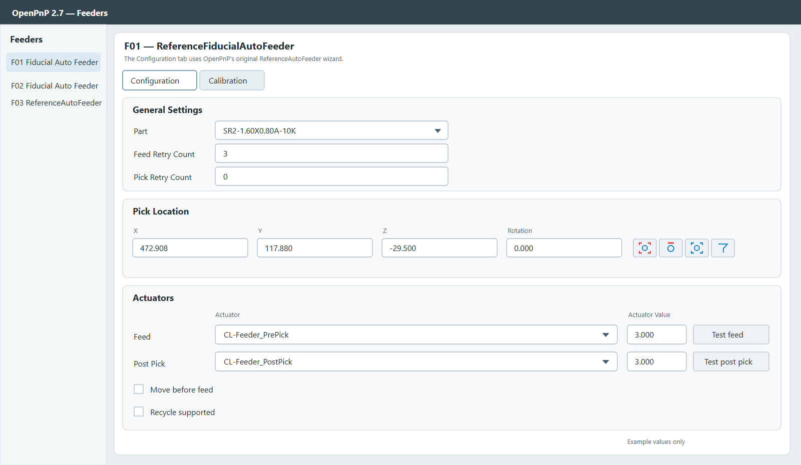
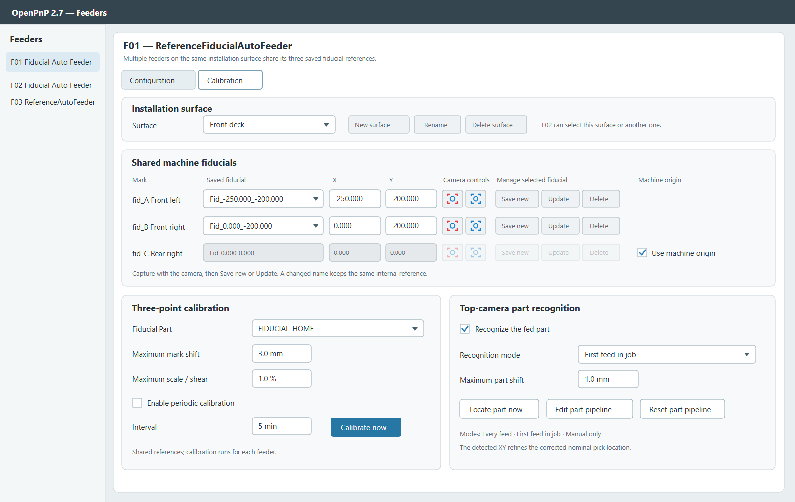

# Three-fiducial auto feeder for OpenPnP

**Language:** English | [日本語](README-ja.md)

`ReferenceFiducialAutoFeeder` extends OpenPnP's `ReferenceAutoFeeder`. A machine-wide catalog stores reusable fiducial coordinates. Each installation surface assigns three saved marks to `fid_A`, `fid_B`, and `fid_C`; every feeder assigned to that surface uses the same three references. An affine transform derived from top-camera measurements corrects each feeder's nominal XY pick position. Optional part recognition uses the same camera to refine the XY position of a presented part.





The **Configuration** tab uses OpenPnP's standard `ReferenceAutoFeeder` wizard. It retains Part selection, feed and pick retry counts, the nominal X/Y/Z/rotation pick location, feed and post-pick actuators and their values and test buttons, **Move before feed**, and **Recycle supported**. The **Calibration** tab contains the custom controls. Choose an installation surface, then choose its saved fiducials from the three dropdowns. The X/Y fields use OpenPnP's standard camera move/capture location buttons. **Save new** stores a captured position, **Update** changes the selected shared mark, and **Delete** removes it from every surface that references it. Checking **Use machine origin (X=0, Y=0)** fixes `fid_C` at the machine coordinate origin and disables its selection and camera controls. The values shown are examples, not machine settings. All labels added by this feeder are in English.

## Files

| Path | Purpose |
| --- | --- |
| `overlay/src/main/java/...` | Feeder, shared fiducial catalog, three-point transform, and configuration wizard source |
| `register-feeder.patch` | Registers the new type in `ReferenceMachine` |
| `openpnp-fiducial-auto-feeder-50dcdce.jar` | Overlay classes for OpenPnP 2.7 build `50dcdce` |
| `Start-CustomOpenPnP.ps1` | Starts that binary with the overlay JAR first on the classpath |
| `Apply-To-OpenPnP-Test.ps1` | Applies the source changes to an OpenPnP `test` checkout |
| `.github/workflows/artifacts.yml` | Manually builds the documented `test` baseline and uploads a runnable artifact |
| `README-ja.md` | Japanese README |
| `docs/installation-guide-en.md` / `docs/installation-guide-ja.md` | Detailed installation, setup, and trial-run instructions in English and Japanese |
| `gui-preview-configuration.svg` / `.png` and `gui-preview.svg` / `.png` | Configuration and Calibration tab previews |

## Part recognition modes

Enable **Recognize the fed part with the top camera**, then select one of the following modes:

| Mode | Behavior |
| --- | --- |
| **Every feed** | Recognizes the presented part after each feed, including a skipped physical feed. This was the behavior of the first implementation. |
| **First feed in job** | Recognizes once on the first feed after OpenPnP prepares this feeder for a job. Later feeds in that job use the three-point corrected nominal position. |
| **Manual only** | Does not recognize during feed. Use **Locate part now** after presenting a part and before picking it. Continuous jobs do not pause automatically for this action; use manual or step operation. |

Part vision is initially disabled. The supplied pipeline is OpenPnP's `ReferenceLoosePartFeeder` pipeline; adapt it to the actual part, lighting, and background before enabling recognition. It must return `RotatedRect` results. The closest result within the configured distance limit supplies XY. The feeder retains the configured Z and corrected nominal rotation.

## Calibration behavior

The shared catalog is saved as a machine property in `machine.xml`. A mark's visible and saved name has the form `Fid_<X>_<Y>` in millimeters with three decimals, for example `Fid_-250.000_-200.000`. It changes automatically when **Update** changes its coordinates. A stable internal ID keeps every surface reference intact across a rename; two marks with the same rounded XY name are not allowed. New feeders join the first existing surface. Older feeders with individually saved fiducial locations are migrated to shared marks and matching surface assignments when their wizard is opened or calibration runs.

Each surface has a name and three dropdown assignments. Feeders on the same surface share all three assignments, including `fid_A` and `fid_B`. Create another surface to use a different A/B/C set. Updating a saved mark affects every surface and feeder that references it and invalidates their calibration. Deleting a mark clears those assignments, so select a replacement before running a job. Deleting a surface leaves its feeders unassigned until another surface is selected. Surface and catalog edits take effect in memory immediately; save the OpenPnP machine configuration to retain them after restart.

The configured fiducial Part is selected from a dropdown backed by OpenPnP's Parts list. The fiducial locator uses the top camera's Default Z for detection; fiducial Z and rotation are neither entered nor used. **Use machine origin** is stored per surface and sets the effective `fid_C` position to X=0, Y=0. Its custom saved mark remains assigned while the option is checked. The origin option refers to OpenPnP's machine coordinate origin, so leave it unchecked when the physical mark is elsewhere. Only XY is transformed for the pick location.

Calibration is queued after homing and performed again for each feeder used at job start. If periodic calibration is enabled, it runs when its interval has elapsed and the machine is idle, or before the next feed. A failed or out-of-limit measurement invalidates the previous transform and prevents that feeder from preparing or feeding until calibration succeeds. Multiple feeders currently measure the shared marks independently.

## Supported builds and installation

- Source baseline: [`openpnp/openpnp` `test`](https://github.com/openpnp/openpnp/tree/test) at `e6274b38f9d6f25e98677f75edde6c4bc7a9ee71`.
- Bundled overlay JAR: the installed OpenPnP 2.7 binary with manifest `Implementation-Version: 2026-07-03_22-12-05.50dcdce`. The launcher rejects another build.
- Java source and the overlay JAR are compiled for Java 11.

To use the matching installed binary without modifying its program files:

```powershell
powershell.exe -ExecutionPolicy Bypass -File .\Start-CustomOpenPnP.ps1 -InstallDir 'C:\Program Files\OpenPnP'
```

Follow the installation guide in [English](docs/installation-guide-en.md) or [Japanese](docs/installation-guide-ja.md) for machine backup, fiducial Part setup, feeder configuration, the three recognition modes, and cautious trial runs. For a different OpenPnP binary, apply the source patch to the corresponding source revision and build a matching version.

For a source-built OpenPnP distribution, manually run **Actions → Artifacts → Run workflow** on GitHub. The workflow builds the documented `test` baseline with the custom feeder and uploads the JAR and `lib` directory as a downloadable artifact. It does not run on pushes.

## Verification and limits

- `ThreePointAffineTest` passes, including the three-point mapping and rejection of collinear marks.
- The added feeder, wizard, and registered `ReferenceMachine` compile against the installed OpenPnP 2.7 JAR and libraries with `javac --release 11`.
- `BinaryOverlaySmokeTest` confirms that the overlay classes take precedence, OpenPnP lists the new feeder type, shared marks and surfaces serialize, and separate Configuration and Calibration tabs expose their expected controls.
- Camera recognition accuracy and machine motion have not been tested on hardware.

The added source is GPL-3.0-or-later, matching OpenPnP's license.
